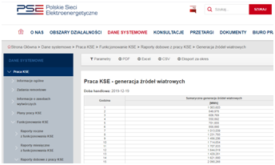

# Chatbot na Messenger

Chatbot pozwala na szybkie sprawdzenie bieżących danych m.in. ceny i volumeny obrotu energią elektryczną na TGE, wielkość generacji energii ze źródeł wiatrowych, czy stan napełnienia magazynów gazu w Polsce.

Za pomocą "przycisków" jesteśmy odsyłani na odpowiednie strony: 
* Towarowej Giełdy Energii, 
* Polskich Sieci Elektroenergetycznych, 
* GAZ-SYSTEMU, 
* Gas Storage Poland, 
* Polskiego Rynku Węgla (Agencja Rozwoju Przemysłu).

Pośrednim celem działania chatbotu jest popularyzacja danych z branży energetycznej.
#

 

#
